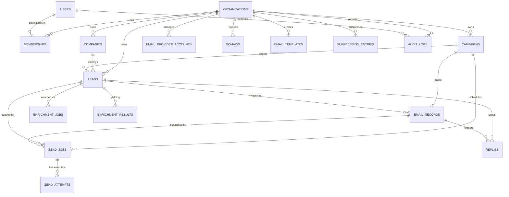

# LeadFlow AI — Production Database Schema Specification

**Version:** 2.0.0-PROD  
**Database Engine:** PostgreSQL 16 (Compatible with SQLite 3.38+ for local tests)  
**ORM:** SQLAlchemy 2.0  
**Multi-Tenant Model:** Row-Level Tenant Partitioning via `organization_id`  

---

## 1. Entity-Relationship Diagram (ERD)

---

## 2. Table Specifications

### 2.1 `organizations`
Tenant boundary entity. All tenant data is tied to this table.
- **Columns**:
  - `id`: `Integer`, Primary Key, Autoincrement.
  - `name`: `VARCHAR(255)`, NOT NULL. Organization legal or business name.
  - `slug`: `VARCHAR(100)`, NOT NULL, Unique, Index. URL-safe slug.
  - `is_active`: `BOOLEAN`, NOT NULL, Default `TRUE`. Status flag.
  - `created_at`: `TIMESTAMP WITH TIME ZONE`, NOT NULL, Default `now()`.
  - `updated_at`: `TIMESTAMP WITH TIME ZONE`, NOT NULL, Default `now()`.
- **Tenant Boundary**: Root tenant anchor.
- **Retention**: Indefinite while active; GDPR purge on explicit tenant account deletion.

---

### 2.2 `users`
Global user credentials and authentication identity.
- **Columns**:
  - `id`: `Integer`, Primary Key, Autoincrement.
  - `email`: `VARCHAR(255)`, NOT NULL, Unique, Index.
  - `password_hash`: `VARCHAR(255)`, NOT NULL. Salted PBKDF2-HMAC-SHA256 hash.
  - `full_name`: `VARCHAR(255)`, NOT NULL.
  - `is_active`: `BOOLEAN`, NOT NULL, Default `TRUE`.
  - `is_superuser`: `BOOLEAN`, NOT NULL, Default `FALSE`.
  - `created_at`: `TIMESTAMP WITH TIME ZONE`, NOT NULL, Default `now()`.
  - `updated_at`: `TIMESTAMP WITH TIME ZONE`, NOT NULL, Default `now()`.
- **Tenant Boundary**: Global user table; access partitioned via `memberships`.
- **Retention**: Retained until user initiates account deletion.

---

### 2.3 `memberships`
Role-Based Access Control (RBAC) mapping users to organizations.
- **Columns**:
  - `id`: `Integer`, Primary Key, Autoincrement.
  - `user_id`: `Integer`, NOT NULL, FK $\to$ `users.id` ON DELETE CASCADE, Index.
  - `organization_id`: `Integer`, NOT NULL, FK $\to$ `organizations.id` ON DELETE CASCADE, Index.
  - `role`: `VARCHAR(20)`, NOT NULL, Enum (`owner`, `admin`, `member`), Default `'member'`.
  - `created_at`: `TIMESTAMP WITH TIME ZONE`, NOT NULL, Default `now()`.
- **Constraints**: `UNIQUE (user_id, organization_id)`.
- **Tenant Boundary**: Scoped to `organization_id`.
- **Retention**: Purged on membership revocation or organization deletion.

---

### 2.4 `companies`
Account/Company intelligence extracted during lead enrichment.
- **Columns**:
  - `id`: `Integer`, Primary Key, Autoincrement.
  - `organization_id`: `Integer`, NOT NULL, FK $\to$ `organizations.id` ON DELETE CASCADE, Index.
  - `name`: `VARCHAR(255)`, NOT NULL.
  - `domain`: `VARCHAR(255)`, NULL, Index. Canonical internet domain name.
  - `website`: `VARCHAR(500)`, NULL. Target homepage URL.
  - `industry`: `VARCHAR(200)`, NULL.
  - `description`: `TEXT`, NULL. AI/Scraped company summary.
  - `key_offering`: `TEXT`, NULL. Core product or service value proposition.
  - `created_at`: `TIMESTAMP WITH TIME ZONE`, NOT NULL, Default `now()`.
  - `updated_at`: `TIMESTAMP WITH TIME ZONE`, NOT NULL, Default `now()`.
- **Indexes**: `Index("ix_companies_org_domain", "organization_id", "domain")`.
- **Tenant Boundary**: Strictly scoped to `organization_id`.
- **Retention**: Retained alongside leads.

---

### 2.5 `leads`
Prospect recipient profiles for sales outreach.
- **Columns**:
  - `id`: `Integer`, Primary Key, Autoincrement.
  - `organization_id`: `Integer`, NOT NULL, FK $\to$ `organizations.id` ON DELETE CASCADE, Index.
  - `company_id`: `Integer`, NULL, FK $\to$ `companies.id` ON DELETE SET NULL.
  - `first_name`: `VARCHAR(100)`, NOT NULL.
  - `last_name`: `VARCHAR(100)`, NOT NULL.
  - `email`: `VARCHAR(255)`, NOT NULL, Index. Recipient email address.
  - `company_name`: `VARCHAR(255)`, NOT NULL.
  - `website`: `VARCHAR(500)`, NULL.
  - `industry`: `VARCHAR(200)`, NULL.
  - `company_description`: `TEXT`, NULL.
  - `key_offering`: `TEXT`, NULL.
  - `enriched`: `BOOLEAN`, NOT NULL, Default `FALSE`.
  - `status`: `VARCHAR(50)`, NOT NULL, Enum (`new`, `enriching`, `enriched`, `email_generated`, `queued`, `emailed`, `followup_1_sent`, `followup_2_sent`, `replied`, `bounced`, `unsubscribed`), Default `'new'`, Index.
  - `source`: `VARCHAR(50)`, NOT NULL, Default `'csv'`.
  - `campaign_id`: `Integer`, NULL, FK $\to$ `campaigns.id` ON DELETE SET NULL, Index.
  - `created_at`: `TIMESTAMP WITH TIME ZONE`, NOT NULL, Default `now()`.
  - `updated_at`: `TIMESTAMP WITH TIME ZONE`, NOT NULL, Default `now()`.
- **Constraints**: `UNIQUE (organization_id, email)`.
- **Indexes**: `ix_leads_org_status`, `ix_leads_org_campaign`.
- **Tenant Boundary**: Scoped to `organization_id`.
- **Retention**: Retained until deleted by tenant or unsubscribed.

---

### 2.6 `campaigns`
Outbound campaign sequences managing limits, pacing, and aggregate deliverability metrics.
- **Columns**:
  - `id`: `Integer`, Primary Key, Autoincrement.
  - `organization_id`: `Integer`, NOT NULL, FK $\to$ `organizations.id` ON DELETE CASCADE, Index.
  - `name`: `VARCHAR(255)`, NOT NULL.
  - `status`: `VARCHAR(50)`, NOT NULL, Enum (`draft`, `active`, `paused`, `completed`, `archived`), Default `'draft'`, Index.
  - `daily_limit`: `Integer`, NOT NULL, Default `50`. Max emails sent per day.
  - `current_daily_limit`: `Integer`, NOT NULL, Default `10`. Warmup daily throttle.
  - `warmup_day`: `Integer`, NOT NULL, Default `0`.
  - `total_leads`: `Integer`, NOT NULL, Default `0`.
  - `total_sent`: `Integer`, NOT NULL, Default `0`.
  - `total_replies`: `Integer`, NOT NULL, Default `0`.
  - `total_bounces`: `Integer`, NOT NULL, Default `0`.
  - `created_at`: `TIMESTAMP WITH TIME ZONE`, NOT NULL, Default `now()`.
  - `started_at`: `TIMESTAMP WITH TIME ZONE`, NULL.
  - `paused_at`: `TIMESTAMP WITH TIME ZONE`, NULL.
- **Tenant Boundary**: Scoped to `organization_id`.
- **Cascade**: Deleting campaign cascades deletion of `send_jobs`.

---

### 2.7 `email_records`
Persistent representation of generated or scheduled email content.
- **Columns**:
  - `id`: `Integer`, Primary Key, Autoincrement.
  - `organization_id`: `Integer`, NOT NULL, FK $\to$ `organizations.id` ON DELETE CASCADE, Index.
  - `lead_id`: `Integer`, NOT NULL, FK $\to$ `leads.id` ON DELETE CASCADE, Index.
  - `campaign_id`: `Integer`, NULL, FK $\to$ `campaigns.id` ON DELETE SET NULL, Index.
  - `subject`: `VARCHAR(500)`, NOT NULL.
  - `body`: `TEXT`, NOT NULL. Generated email body.
  - `email_type`: `VARCHAR(20)`, NOT NULL, Enum (`initial`, `followup_1`, `followup_2`), Default `'initial'`.
  - `status`: `VARCHAR(20)`, NOT NULL, Enum (`pending`, `queued`, `sent`, `failed`, `bounced`), Default `'pending'`, Index.
  - `provider_name`: `VARCHAR(50)`, NOT NULL, Default `'gmail'`.
  - `provider_account`: `VARCHAR(255)`, NULL. Sender address.
  - `provider_message_id`: `VARCHAR(255)`, NULL, Unique, Index. Vendor message identifier.
  - `provider_thread_id`: `VARCHAR(255)`, NULL, Index. Vendor thread identifier.
  - `idempotency_key`: `VARCHAR(128)`, NOT NULL, Unique, Index.
  - `retry_count`: `Integer`, NOT NULL, Default `0`.
  - `error_message`: `TEXT`, NULL.
  - `scheduled_at`: `TIMESTAMP WITH TIME ZONE`, NULL.
  - `sent_at`: `TIMESTAMP WITH TIME ZONE`, NULL.
  - `created_at`: `TIMESTAMP WITH TIME ZONE`, NOT NULL, Default `now()`.
- **Indexes**: `ix_email_records_org_status`, `ix_email_records_lead_type`.
- **Tenant Boundary**: Scoped to `organization_id`.
- **Retention**: Retained for audit and analytics (90–365 days retention policy).

---

### 2.8 `send_jobs`
Durable queue job table. Implements worker leases and exponential backoff retry state machine.
- **Columns**:
  - `id`: `Integer`, Primary Key, Autoincrement.
  - `organization_id`: `Integer`, NOT NULL, FK $\to$ `organizations.id` ON DELETE CASCADE, Index.
  - `campaign_id`: `Integer`, NOT NULL, FK $\to$ `campaigns.id` ON DELETE CASCADE, Index.
  - `lead_id`: `Integer`, NOT NULL, FK $\to$ `leads.id` ON DELETE CASCADE, Index.
  - `email_record_id`: `Integer`, NOT NULL, FK $\to$ `email_records.id` ON DELETE CASCADE, Index.
  - `status`: `VARCHAR(20)`, NOT NULL, Enum (`pending`, `queued`, `processing`, `retry_wait`, `sent`, `failed`, `cancelled`), Default `'pending'`, Index.
  - `idempotency_key`: `VARCHAR(128)`, NOT NULL, Unique, Index.
  - `lease_worker_id`: `VARCHAR(100)`, NULL, Index. Claiming worker process ID.
  - `lease_expires_at`: `TIMESTAMP WITH TIME ZONE`, NULL, Index. Expiry time of current lease lock.
  - `attempt_count`: `Integer`, NOT NULL, Default `0`.
  - `max_attempts`: `Integer`, NOT NULL, Default `3`.
  - `scheduled_for`: `TIMESTAMP WITH TIME ZONE`, NOT NULL, Default `now()`, Index.
  - `last_error`: `TEXT`, NULL.
  - `created_at`: `TIMESTAMP WITH TIME ZONE`, NOT NULL, Default `now()`.
  - `updated_at`: `TIMESTAMP WITH TIME ZONE`, NOT NULL, Default `now()`.
- **Indexes**: Composite polling index `ix_send_jobs_poll ("status", "scheduled_for", "lease_expires_at")`.
- **Tenant Boundary**: Scoped to `organization_id`.
- **Retention**: Completed/Failed jobs purged after 30 days by maintenance worker.

---

### 2.9 `send_attempts`
Immutable log of every physical dispatch attempt for each job.
- **Columns**:
  - `id`: `Integer`, Primary Key, Autoincrement.
  - `send_job_id`: `Integer`, NOT NULL, FK $\to$ `send_jobs.id` ON DELETE CASCADE, Index.
  - `attempt_number`: `Integer`, NOT NULL.
  - `worker_id`: `VARCHAR(100)`, NOT NULL.
  - `status`: `VARCHAR(50)`, NOT NULL (`success`, `transient_failure`, `permanent_failure`).
  - `provider_name`: `VARCHAR(50)`, NOT NULL.
  - `provider_response_code`: `VARCHAR(50)`, NULL.
  - `provider_message_id`: `VARCHAR(255)`, NULL.
  - `error_message`: `TEXT`, NULL.
  - `started_at`: `TIMESTAMP WITH TIME ZONE`, NOT NULL, Default `now()`.
  - `finished_at`: `TIMESTAMP WITH TIME ZONE`, NULL.
- **Retention**: 90 days.

---

### 2.10 `email_provider_accounts`
Registered sender mailbox accounts with AES-encrypted credentials at rest.
- **Columns**:
  - `id`: `Integer`, Primary Key, Autoincrement.
  - `organization_id`: `Integer`, NOT NULL, FK $\to$ `organizations.id` ON DELETE CASCADE, Index.
  - `provider_type`: `VARCHAR(20)`, NOT NULL, Enum (`gmail`, `smtp`, `mock`), Default `'gmail'`.
  - `account_email`: `VARCHAR(255)`, NOT NULL.
  - `display_name`: `VARCHAR(255)`, NULL.
  - `encrypted_credentials`: `TEXT`, NULL. Fernet-encrypted ciphertext of OAuth token or app password.
  - `is_active`: `BOOLEAN`, NOT NULL, Default `TRUE`.
  - `is_healthy`: `BOOLEAN`, NOT NULL, Default `TRUE`.
  - `sends_today`: `Integer`, NOT NULL, Default `0`.
  - `sends_this_hour`: `Integer`, NOT NULL, Default `0`.
  - `last_send_at`: `TIMESTAMP WITH TIME ZONE`, NULL.
  - `last_reset_date`: `VARCHAR(10)`, NULL (`YYYY-MM-DD`).
  - `error_message`: `TEXT`, NULL.
  - `created_at`: `TIMESTAMP WITH TIME ZONE`, NOT NULL, Default `now()`.
  - `updated_at`: `TIMESTAMP WITH TIME ZONE`, NOT NULL, Default `now()`.
- **Constraints**: `UNIQUE (organization_id, account_email)`.
- **Indexes**: `Index("ix_provider_accounts_org_active", "organization_id", "is_active", "is_healthy")`.
- **Tenant Boundary**: Scoped to `organization_id`.

---

### 2.11 `suppression_entries`
Do-Not-Contact list preventing outreach to unsubscribed prospects or hard bounces.
- **Columns**:
  - `id`: `Integer`, Primary Key, Autoincrement.
  - `organization_id`: `Integer`, NOT NULL, FK $\to$ `organizations.id` ON DELETE CASCADE, Index.
  - `email`: `VARCHAR(255)`, NOT NULL, Index.
  - `reason`: `VARCHAR(20)`, NOT NULL, Enum (`unsubscribe`, `bounce`, `complaint`, `manual`).
  - `source`: `VARCHAR(100)`, NOT NULL, Default `'user_optout'`.
  - `created_at`: `TIMESTAMP WITH TIME ZONE`, NOT NULL, Default `now()`.
- **Constraints**: `UNIQUE (organization_id, email)`.
- **Retention**: Indefinite (legal opt-out compliance requirement).

---

### 2.12 `enrichment_jobs` & `enrichment_results`
Durable jobs for website crawling and structured company feature extraction.
- **`enrichment_jobs`**:
  - `id`: `Integer`, Primary Key.
  - `organization_id`: `Integer`, FK $\to$ `organizations.id`.
  - `lead_id`: `Integer`, FK $\to$ `leads.id`.
  - `target_url`: `VARCHAR(500)`.
  - `status`: `VARCHAR(20)` (`pending`, `queued`, `processing`, `sent`, `failed`).
  - `lease_worker_id`, `lease_expires_at`, `attempt_count`, `max_attempts`, `error_message`.
- **`enrichment_results`**:
  - Extracted metadata: `resolved_ip`, `fetch_method` (`http` / `browser`), `http_status`, `title`, `meta_description`, `headings_json`, `extracted_text`, `summary_description`, `key_offering`, `confidence_score` ($0.0 \dots 1.0$).

---

### 2.13 `domains`
Sending domain deliverability authentication records.
- **Columns**: `id`, `organization_id`, `domain_name`, `has_mx`, `has_spf`, `has_dkim`, `has_dmarc`, `spf_record`, `dmarc_record`, `mx_records_json`, `is_healthy`, `health_score`, `last_checked_at`, `created_at`.
- **Constraints**: `UNIQUE (organization_id, domain_name)`.

---

### 2.14 `replies`
Inbound email replies classified via rule heuristics and AI models.
- **Columns**: `id`, `organization_id`, `lead_id`, `email_record_id`, `reply_body`, `classification` (`interested`, `not_interested`, `out_of_office`, `unsubscribe`, `spam`, `unknown`), `confidence_score`, `provider_message_id`, `provider_thread_id`, `received_at`.

---

### 2.15 `audit_logs`
Immutable compliance audit log of administrative and critical operations.
- **Columns**: `id`, `organization_id`, `user_id`, `action` (`user.login`, `campaign.start`, `email.sent`, etc.), `resource_type`, `resource_id`, `details_json`, `ip_address`, `created_at`.
- **Retention**: 365 days.
