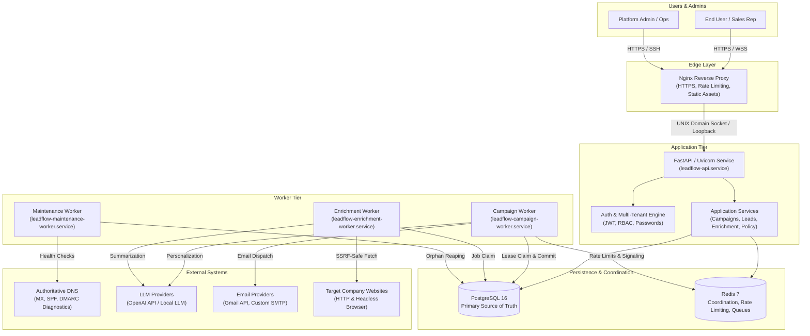
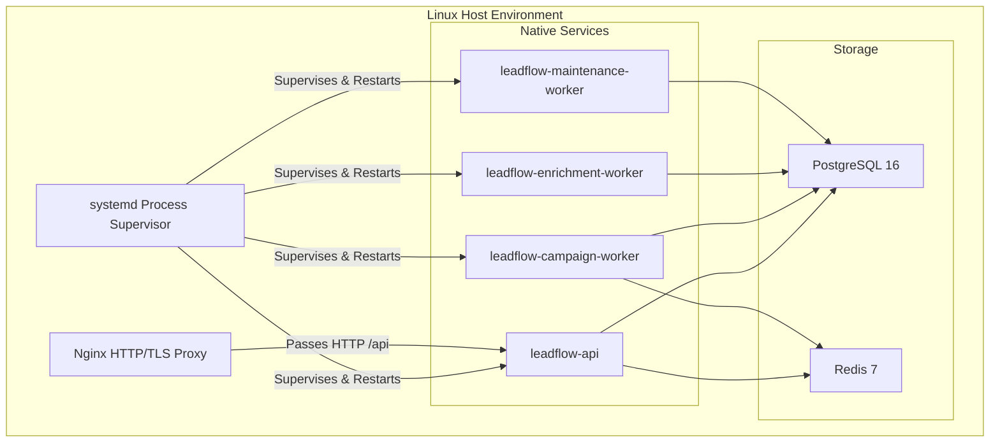
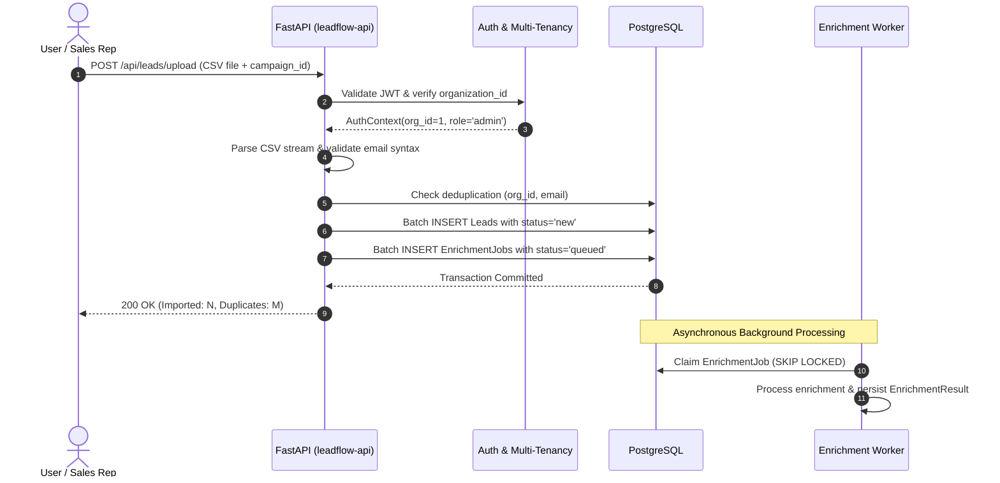
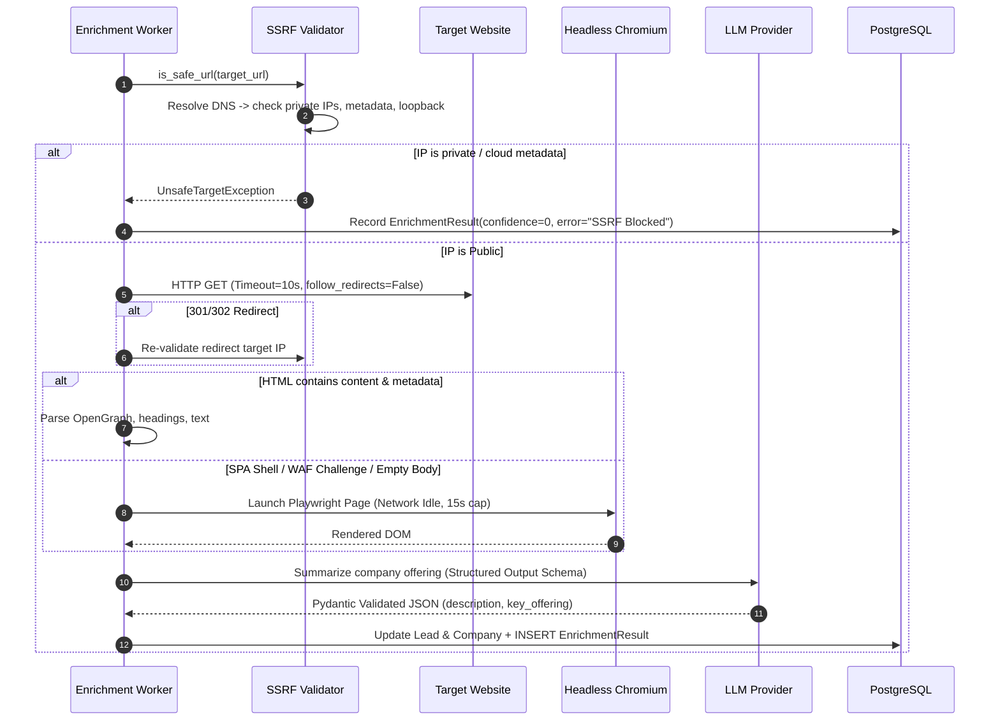
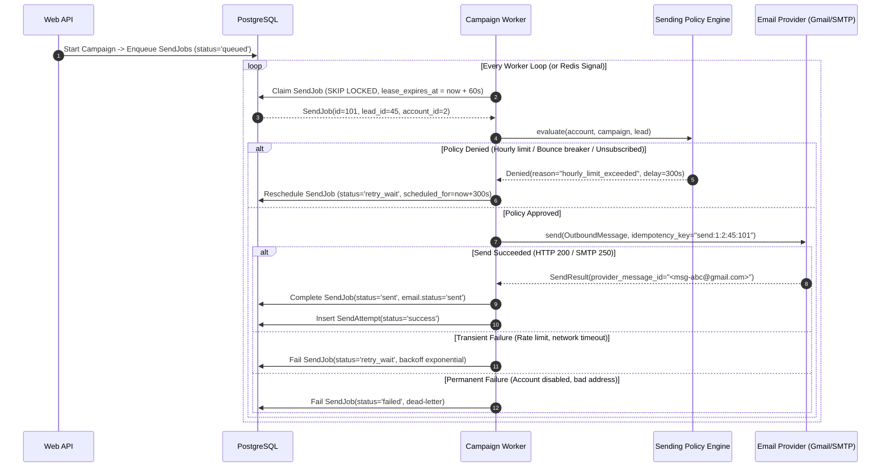

# LeadFlow AI — High-Level Design (HLD)

**Version:** 2.0.0-PROD  
**Status:** Approved Architecture  
**Target Runtime:** Native Linux (Ubuntu 22.04 / 24.04 LTS) — Systemd, Nginx, Python 3.12, PostgreSQL 16, Redis 7 (No Containers).

---

## 1. System Context

LeadFlow AI is an enterprise-grade outbound intelligence and personalized email delivery platform designed for high-deliverability sales prospecting and lead enrichment.

### Context Entities
1. **Users**: Authenticated sales reps, account executives, and business developers operating within specific organization tenants.
2. **Administrators**: Platform operators managing tenant memberships, system configuration, sender accounts, and deliverability policies.
3. **Organizations (Tenants)**: Strict operational boundaries. All leads, campaigns, credentials, and logs are segregated by `organization_id`.
4. **External Email Providers**: Google Workspace (Gmail API via OAuth2/App Passwords), custom SMTP relays, and test sandboxes.
5. **External LLM Providers**: OpenAI API (`gpt-4o-mini`, `gpt-4o`) or mock test providers with structured JSON outputs.
6. **External Prospect Websites**: Public corporate websites analyzed for value propositions, key offerings, and company metadata.
7. **DNS Infrastructure**: Live nameserver queries for MX, SPF, DKIM, and DMARC verification.
8. **Browser Infrastructure**: Local headless Chromium running via Playwright, used strictly as a secondary fallback when HTTP scrapers encounter JavaScript shells.

---

## 2. Component Architecture

### 2.1 Component Specifications

| Component | Responsibility | Inputs | Outputs | Dependencies | Failure Mode & Recovery | Scaling Strategy |
| :--- | :--- | :--- | :--- | :--- | :--- | :--- |
| **Nginx** | TLS termination, HTTP $\to$ HTTPS redirect, static dashboard hosting, request buffering, rate limiting, security headers. | Public HTTP/S traffic (ports 80, 443). | Reverse-proxied requests to Uvicorn (`http://127.0.0.1:8000`). | OS network stack, SSL certificates. | Returns 502/504 if upstream Uvicorn is down. Auto-restarted by `systemd`. | Event-driven epoll; scales to 50k+ concurrent conns on a single core. |
| **API (`leadflow-api`)** | REST API endpoints, request validation, authentication, multi-tenant enforcement, CSV/Sheets parsing, durable job creation. | JSON/Multipart HTTP requests with JWT/API Keys. | JSON responses, database entities, queued jobs. | PostgreSQL, Redis. | Stateless; crashes handled by systemd restart (`Restart=always`, `RestartSec=3s`). | Scale horizontally by running multiple Uvicorn worker processes via systemd or socket activation. |
| **Auth Service** | Password hashing (PBKDF2), Fernet credential encryption, JWT creation/verification, tenant scoping. | User credentials, tokens, plaintext secrets. | Validated AuthContext, encrypted ciphertexts. | Cryptographic libraries (`cryptography`, `hashlib`). | Rejects tampered tokens; fails closed. | Pure CPU bound; zero external dependencies. |
| **Campaign Worker** | Drains `send_jobs`, checks sending policies, evaluates recipient suppression, calls email providers, records attempts. | Queued `SendJob` records from PostgreSQL/Redis. | Dispatched emails, `EmailRecord` status updates, `SendAttempt` logs. | PostgreSQL, Redis, Email Providers. | Worker crash leaves job in `PROCESSING`; lease expires after 60s and maintenance worker rescues job. | Run $N$ parallel campaign worker units (`leadflow-campaign-worker@1.service`, etc.). |
| **Enrichment Worker** | Drains `enrichment_jobs`, executes SSRF-safe HTTP scraping, triggers Playwright fallback on JS shells, runs AI summarization. | Target domain/URL, Lead ID. | `EnrichmentResult`, updated `Company` / `Lead` metadata. | Target Websites, Playwright, LLM API, PostgreSQL. | Timeouts or 403s recorded with confidence score 0; never crashes worker. | Run dedicated worker instances isolated from campaign dispatch. |
| **Maintenance Worker** | Periodic background tasks: orphaned lease reaping, sending account daily counter reset, DNS health refresh, retention cleanup. | Timer signals (every 30–60s). | Reaped jobs reset to `QUEUED`, refreshed `Domain` scores. | PostgreSQL, DNS resolver. | Resilient loop; logs error and retries next tick. | Single leader process per cluster (or distributed lock via Redis). |
| **PostgreSQL 16** | Relational source of truth, foreign key constraints, ACID transaction isolation, ACID job queue state. | SQL queries from API and workers. | Relational rows, locked job records (`FOR UPDATE SKIP LOCKED`). | Local filesystem (NVMe SSD). | Write-ahead logging (WAL); crash recovery on restart. Hot-standby replication. | Vertical scaling (CPU/RAM/IOPS) + connection pooling (PgBouncer). |
| **Redis 7** | High-performance distributed coordination, atomic rate limiting tokens, pub/sub worker wakeup signaling. | Redis commands (`SET`, `EVAL`, `INCR`, `BLPOP`). | Atomic responses, cached counters. | System RAM. | If Redis fails, workers gracefully degrade to DB-only polling and DB-only rate limits. | In-memory with append-only file (AOF) persistence. |

---

## 3. End-to-End Data Flows

### 3.1 Lead Ingestion Flow

### 3.2 Lead Enrichment Flow

### 3.3 Campaign Dispatch Flow

---

## 4. Failure Architecture & Recovery Matrix

| Failure Event | Immediate System Impact | Automated Containment & Recovery Mechanism | Human Intervention Required? |
| :--- | :--- | :--- | :--- |
| **API Process Crash** | Current in-flight HTTP requests drop with 502 Bad Gateway. | systemd immediately restarts `leadflow-api.service` (`RestartSec=3s`). System validates database connection and begins accepting traffic. Active background campaigns continue uninterrupted because worker processes are decoupled. | No. Alert logged to journald. |
| **Campaign Worker Crash** | Currently claimed job stops executing midway. | SendJob remains in `PROCESSING` state with `lease_expires_at = now + 60s`. After 60 seconds, `leadflow-maintenance-worker` reaps the job and resets it to `QUEUED`. A surviving worker claims and dispatches it. | No. Seamless recovery. |
| **PostgreSQL Outage** | API returns 503 Service Unavailable; workers pause and log connection errors. | Workers enter exponential connection retry loops (5s, 10s, 20s, up to 60s). Once PostgreSQL service recovers, connections automatically re-establish and processing resumes without state corruption. | Only if PostgreSQL disk is full or database corrupted. |
| **Redis Outage** | Rate limiting and fast signaling degraded. | System degrades gracefully: workers fall back to database-driven polling (`SELECT ... FOR UPDATE SKIP LOCKED`) and database-driven send counter tracking. Jobs continue executing. | Investigate Redis logs / restart Redis via systemd. |
| **Email Provider API Failure (Gmail 429/503)** | Outbound messages cannot be accepted by provider. | Error is categorized as `RATE_LIMIT` or `TEMPORARY_FAILURE`. Worker sets `SendJob.status = RETRY_WAIT` with exponential backoff delay. Policy engine marks account `is_healthy = False` if failures persist. | No for transient; Yes if Google revoked OAuth token. |
| **Target Website Returns 403 / 429 During Enrichment** | Lead enrichment cannot scrape HTML. | Scraper marks fetch as failed, records HTTP code, sets `confidence_score = 0.0`. Fallback uses whatever metadata exists. Does not crash worker or block lead from outreach. | No. Expected web scraping condition. |
| **Headless Browser (Chromium) Crash** | Browser page crashes or times out. | Playwright catch-block captures exception, cleans up browser context, and falls back to HTTP-only extracted text. Global semaphore prevents cascading OOM crashes. | No. |
| **Server Power Loss / Hard Reboot** | System halts abruptly. | On boot, systemd automatically starts PostgreSQL $\to$ Redis $\to$ API $\to$ Workers in strict dependency order (`After=postgresql.service redis.service`). Maintenance worker runs on startup, reclaims all stale processing leases, and resumes campaigns safely. | No. System is fully crash-consistent. |
| **Deployment During Active Campaigns** | In-flight jobs might be interrupted if workers are killed. | Deployment script issues `systemctl stop --signal=SIGTERM leadflow-campaign-worker`. Worker catches `SIGTERM`, finishes current email sending cycle, and exits cleanly before new code is activated. Zero duplicate sends. | No. Managed by `deploy/scripts/deploy.sh`. |
