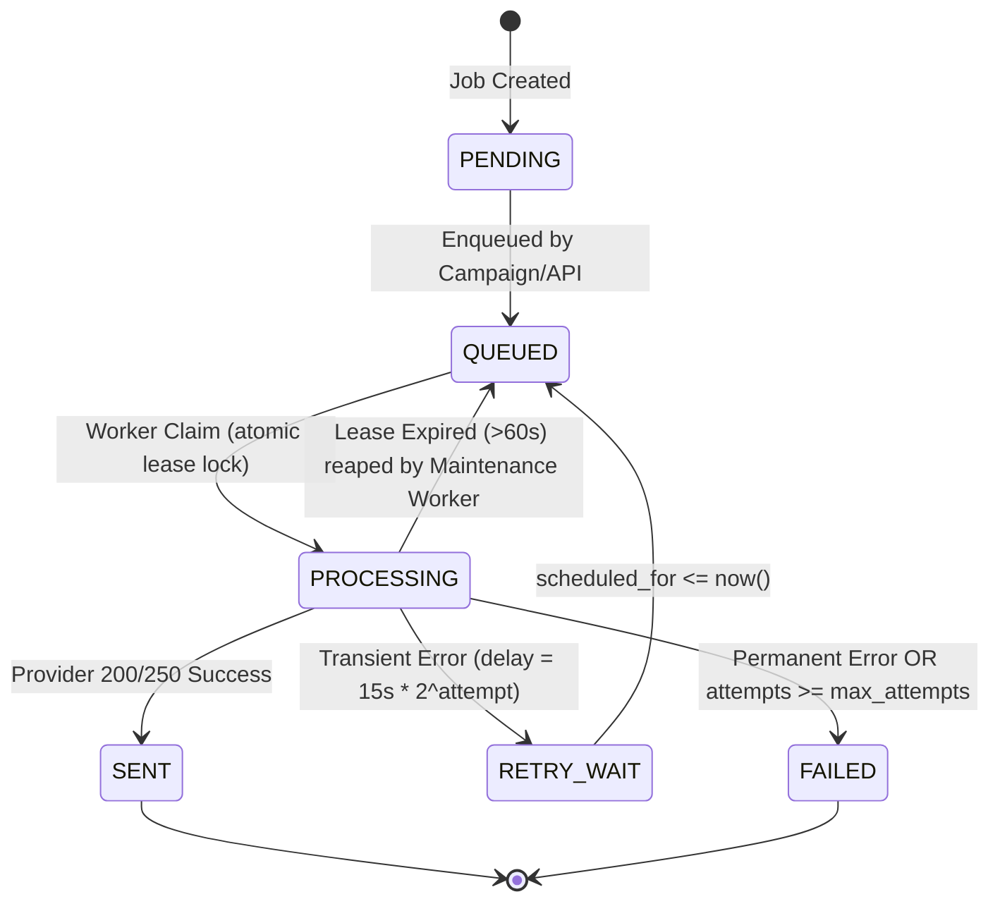

# LeadFlow AI — Low-Level Design (LLD)

**Version:** 2.0.0-PROD  
**Status:** Approved Implementation Specification  
**Language:** Python 3.12+ / FastAPI / SQLAlchemy 2.0 / Pydantic v2  

---

## 1. Package Architecture

The LeadFlow AI backend follows a modular, domain-driven structure adapted directly from the existing repository without introducing unneeded boilerplate or premature micro-frameworks:

```text
leadflow-ai/
├── api/                                # REST API route layer
│   ├── __init__.py
│   └── routes.py                       # FastAPI route handlers & dependencies
├── core/                               # Core foundational utilities
│   ├── __init__.py
│   ├── config.py                       # pydantic-settings & validation
│   ├── queue.py                        # DurableQueue & worker lease engine
│   └── security.py                     # PBKDF2, AES-Fernet, JWT, SSRF filter
├── database/                           # Persistence layer
│   ├── __init__.py
│   ├── database.py                     # Engine, sessionmaker, pool tuning
│   └── models.py                       # SQLAlchemy 2.0 declarative models
├── modules/                            # Domain capability modules
│   ├── ai_engine/                      # LLM generation & structured schemas
│   │   ├── generator.py
│   │   ├── followup_generator.py
│   │   ├── optimizer.py
│   │   └── llm_provider.py             # LLM provider protocol & mock/openai
│   ├── email_sender/                   # Outbound dispatch engine
│   │   ├── batch_sender.py
│   │   ├── gmail_client.py
│   │   ├── account_manager.py
│   │   └── provider_interface.py       # EmailProvider protocol & schemas
│   ├── lead_enrichment/                # Website intelligence
│   │   ├── enricher.py
│   │   └── pipeline.py                 # SSRF-safe HTTP & Playwright pipeline
│   ├── lead_ingestion/                 # Prospect data ingestion
│   │   ├── csv_handler.py
│   │   ├── sheets_handler.py
│   │   └── validator.py
│   ├── reply_tracker/                  # Inbound reply monitoring
│   │   ├── classifier.py               # Precedence-ordered classifier
│   │   └── monitor.py
│   └── scheduler/                      # Followup scheduling logic
│       └── followup_scheduler.py
├── services/                           # Cross-cutting business services
│   ├── domain_health.py                # DNS diagnostics (MX/SPF/DKIM/DMARC)
│   └── sending_policy.py               # Pre-flight compliance & limits gate
├── workers/                            # Standalone background processes
│   ├── campaign_worker.py              # Outbound dispatch worker
│   ├── enrichment_worker.py            # Website scraping & AI worker
│   └── maintenance_worker.py           # Lease reaping & health refresh
├── deploy/                             # Native Linux deployment assets
│   ├── nginx/                          # Nginx reverse proxy configurations
│   ├── systemd/                        # Linux systemd service units
│   └── scripts/                        # Production operational shell scripts
├── tests/                              # Comprehensive test suite
│   ├── api/
│   ├── contract/
│   ├── e2e/
│   ├── failure/
│   ├── integration/
│   └── unit/
└── main.py                             # FastAPI application entrypoint
```

---

## 2. Core Subsystem Implementation Details

### 2.1 Durable Queue & Lease Ownership State Machine

The queue lives in `core/queue.py` and operates against the `send_jobs` and `enrichment_jobs` tables.



#### Atomic Claim Mechanism
```python
# PostgreSQL atomic claim using SKIP LOCKED
query = (
    session.query(SendJob)
    .join(Campaign, SendJob.campaign_id == Campaign.id)
    .filter(
        Campaign.status == CampaignStatus.ACTIVE,
        or_(
            and_(
                SendJob.status.in_([JobStatus.QUEUED, JobStatus.RETRY_WAIT]),
                SendJob.scheduled_for <= now,
            ),
            and_(
                SendJob.status == JobStatus.PROCESSING,
                SendJob.lease_expires_at < now,
            ),
        ),
    )
    .order_by(SendJob.scheduled_for.asc())
    .with_for_update(skip_locked=True)
)
```
- In PostgreSQL, `with_for_update(skip_locked=True)` guarantees that multiple concurrent worker processes never lock the same row or block each other waiting for table locks.
- If running under SQLite (development/tests), the query executes standard ordered retrieval.

---

### 2.2 Distributed Rate Limiting & Coordination (Redis + DB Fallback)

To enforce hourly and daily sending rates across multiple worker processes without race conditions:

1. **Primary (Redis Token Bucket / Sliding Window)**:
   - Key: `ratelimit:account:{account_id}:hour:{YYYYMMDDHH}`
   - Operation: `INCR` with a 3600-second TTL.
   - If the returned value exceeds `hourly_limit`, send is denied.
2. **Fallback (PostgreSQL Atomic Transaction)**:
   - When Redis is unavailable or unconfigured, the system falls back to `services/sending_policy.py`:
   ```sql
   SELECT sends_today, sends_this_hour 
   FROM email_provider_accounts 
   WHERE id = :account_id FOR UPDATE;
   ```
   Upon successful send, counter is updated atomically:
   ```sql
   UPDATE email_provider_accounts 
   SET sends_today = sends_today + 1, 
       sends_this_hour = sends_this_hour + 1,
       last_send_at = :now 
   WHERE id = :account_id;
   ```

---

### 2.3 Email Provider Interface Protocol & Idempotency Key

All outbound communication is abstracted behind Python's `typing.Protocol`:

```python
class EmailProvider(Protocol):
    async def send(self, message: OutboundMessage) -> SendResult: ...
    async def validate_credentials(self) -> bool: ...
```

#### Deterministic Idempotency Key
Every `SendJob` and `OutboundMessage` carries a globally unique idempotency key:
$$\text{key} = \texttt{"send:\{org\_id\}:\{campaign\_id\}:\{lead\_id\}:\{email\_record\_id\}"}$$
- In Gmail API calls, the key is passed as a custom message header `X-Entity-Ref-ID: {key}` or client reference ID.
- Before re-attempting a dispatch, the worker checks if `email_records.provider_message_id` has already been populated. If so, it reconciles the job as `SENT` immediately without re-transmitting to the SMTP/API socket.

---

### 2.4 SSRF-Safe Multi-Tier Lead Enrichment Pipeline

Enrichment in `modules/lead_enrichment/pipeline.py` uses a 3-tier progressive approach:

1. **SSRF Pre-Flight Check**:
   - Hostname is resolved via `socket.getaddrinfo()`.
   - Every returned IP address is checked against blocked IPv4 and IPv6 subnets:
     - `127.0.0.0/8` (Loopback)
     - `10.0.0.0/8`, `172.16.0.0/12`, `192.168.0.0/16` (RFC 1918 Private)
     - `169.254.169.254` (Cloud Metadata / Link-Local)
     - `0.0.0.0/8`, `224.0.0.0/4`, `240.0.0.0/4`
     - `::1`, `fc00::/7`, `fe80::/10`
   - Redirection is executed with `follow_redirects=False`. Each redirect target URL is independently passed through the SSRF pre-flight check before the next hop is requested.
2. **Tier 1: Fast HTTP Scraping**:
   - Uses `httpx.AsyncClient` with a 10s timeout, browser `User-Agent`, and compression.
   - Extracts title, meta tags (OpenGraph, description), and semantic text (`<p>`, `<h1>`, `<h2>`).
   - If content length $> 250$ words and no anti-bot/SPA indicators, extraction completes with high confidence.
3. **Tier 2: Playwright Headless Browser Fallback**:
   - Triggered only if Tier 1 detects:
     - SPA shells (`<div id="root"></div>` with empty text).
     - WAF / Anti-Bot challenge pages (Cloudflare Turnstile, "Please enable JavaScript").
     - HTTP 403 / 503 with JavaScript challenges.
   - Guarded by an `asyncio.Semaphore(3)` to cap concurrent Chromium instances and prevent memory exhaustion.
   - Enforces a strict 15s page timeout with network-idle waiting.

---

### 2.5 Reply Classifier Precedence Rules

To prevent prospects replying "Please do not contact me" from being incorrectly categorized as `INTERESTED` (which occurred in the prototype due to substring matching on "interest"), `modules/reply_tracker/classifier.py` enforces strict rule precedence:

1. **Precedence 1: Unsubscribe / Opt-Out** (e.g., `"unsubscribe"`, `"remove me"`, `"do not email"`).
2. **Precedence 2: Negative / Not Interested** (e.g., `"not interested"`, `"no thank you"`, `"pass on this"`).
3. **Precedence 3: Out of Office** (e.g., `"out of the office"`, `"auto-reply"`, `"annual leave"`).
4. **Precedence 4: Positive Interest** (e.g., `"interested"`, `"let's talk"`, `"call me"`, `"send more info"`).
5. **Precedence 5: LLM Structured Fallback** if rule heuristics return `UNKNOWN`.

---

### 2.6 Credential Lifecycle & Encryption

1. **Storage**: All sensitive third-party credentials (SMTP passwords, OAuth refresh tokens) are encrypted before insertion into `email_provider_accounts.encrypted_credentials`.
2. **Algorithm**: Fernet specification (`cryptography.fernet.Fernet`), combining 128-bit AES in CBC mode with PKCS7 padding and HMAC-SHA256 authentication using `SECRET_KEY`.
3. **Display**: Endpoints return `mask_secret(val)` (`"••••••••"`) to prevent credential leakage in dashboard logs or network sniffers.
